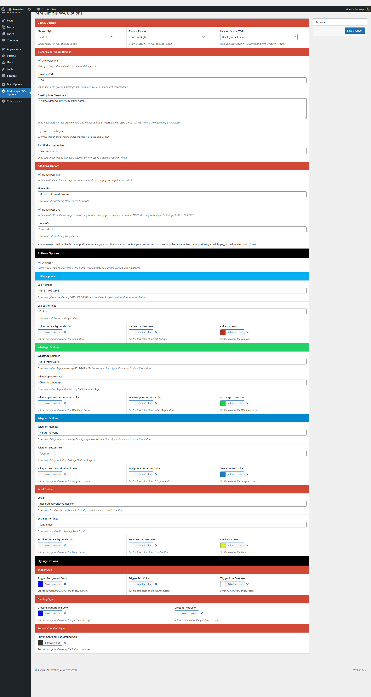

MM Simple WA adalah WordPress plugin untuk menghadirkan fitur call to action dengan berbagai pilihan platform seperti: Chat Whatsapp, Chat Telegram, Email dan Telepon (platform lain akan segera menyusul).

Fitur-fitur yang tersedia:
- Pilihan platform: Chat Whatsapp, Chat Telegram, Email dan Telepon
- Styling Options: Warna, Ukuran, posisi dll
- Include post, page dan custom post type title kedalam pesan
- Include post, page dan custom post type URL kedalam pesan

## Instalasi
1. Upload folder `simple-wa` ke dalam folder `/wp-content/plugins/`
2. Aktifkan plugin melalui menu 'Plugins' di WordPress
3. Buka menu `MM Simple WA Options` di dashboard WordPress untuk mengatur pengaturan plugin
4. Masukan nomor Whatsapp, Telegram, Email dan nomor telepon yang ingin dihubungi kosongkan jika tidak ingin menampilkan platform tersebut

## Support
Jika ada pertanyaan atau masalah dengan plugin ini visit: https://budiharyono.id/

## Changelog

### 1.0.2
- Fixing bug
- Add new feature

### 1.0.1
- Fixing bug

### 1.0.0
- Initial release

## Screenshots

